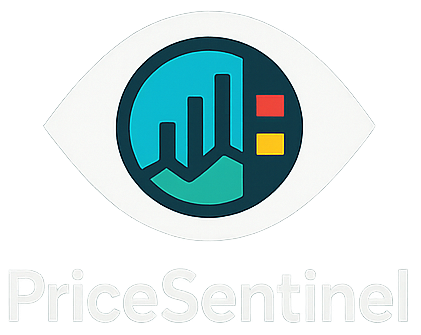

# PriceSentinel: Event-Aware Energy Price Forecasting

**Multi-country energy price forecasting system with event awareness and data quality guards.**



## Features

- **Multi-country support**: Extensible architecture for any country/market
- **Event-aware forecasting**: Incorporates holidays, DST transitions, and manual events
- **Data quality guards**: Cleaning and basic validation for electricity, weather, and gas data
- **Feature engineering & training**: Baseline feature set and model training (scikit-learn) for mock country
- **Comprehensive monitoring**: Planned monitoring of data quality, model performance, and alerts
- **Country abstraction**: Add new countries with minimal code changes

## Current Status

- **Fully Implemented MVP**: End-to-end pipeline (Fetch → Clean → Features → Train → Forecast) works for Mock Country (XX) and Portugal (PT).
- **Core Capabilities**:
  - **Inference**: Day-ahead price forecasting with runtime data guards.
  - **Validation**: Time Series Cross-Validation and Backtesting.
  - **Quality**: Windows-compatible automation, 100% test pass rate, and CI/CD guardrails established.
- **Phases 6–7**: Inference & Training Optimization (Complete).
- **Phases 8–10**: CI/CD (Complete). Monitoring and Deployment (Next).

### Implemented Countries

- **Portugal (PT)**: Full implementation with ENTSO-E, Open-Meteo, and TTF data.
- **Mock Country (XX)**: Synthetic data for testing and fast training demos.

## Quick Start

A quick guide to get started with PriceSentinel.

### Installation

```bash
# Clone repository
git clone https://github.com/JDPS/pricesentinel.git
cd pricesentinel

# Create and activate a virtual environment (example with venv)
python -m venv .venv

# Windows:
.venv\Scripts\activate
# Linux/Mac:
source .venv/bin/activate

# Install runtime dependencies
pip install .

# (Optional) Install development extras (tests, linting, docs)
pip install ".[dev,test,docs]"

# Configure environment
copy .env.example .env
# Edit .env with your API keys
```

### Configuration

1. Add your ENTSO-E API key to `.env`:

   ```bash
   ENTSOE_API_KEY=your_key_here
   ```

2. (Optional) Download TTF gas prices and place in:

   ```text
   data/manual_imports/ttf_gas_prices.csv
   ```

### Basic Usage

```bash
# Test with mock country (no API keys required) – fetch only
python run_pipeline.py --country XX --fetch --start-date 2024-01-01 --end-date 2024-01-07

# Run full pipeline for mock country (fetch → clean → features → train)
python run_pipeline.py --country XX --all --start-date 2024-01-01 --end-date 2024-01-07

# Fetch data for Portugal
python run_pipeline.py --country PT --fetch --start-date 2024-01-01 --end-date 2024-01-31

# Run full pipeline for Portugal (training assumes sufficient data and configuration)
python run_pipeline.py --country PT --all --start-date 2024-01-01 --end-date 2024-12-31

# Generate forecasts (after training)
python run_pipeline.py --country PT --forecast --forecast-date 2024-01-08
```

## Advanced Usage

### Cross-Validation

Evaluate model performance using Time Series Split Cross-Validation:

```bash
python experiments/run_cv.py --country PT --start 2023-01-01 --end 2023-12-31 --splits 5
```

This generates a detailed report in `outputs/reports/`.

### Benchmarking

Run a full backtest benchmark (Train 2023 / Test Jan 2024):

```bash
python experiments/benchmark_pt.py
```

## Project Structure

```text
pricesentinel/
  config/                  # Configuration files
    countries/             # Country-specific configs
      PT.yaml              # Portugal configuration
      XX.yaml              # Mock country configuration
    country_registry.py    # Country registry and factory
    validation.py          # Pydantic validation schemas

  core/                    # Core pipeline logic
    abstractions.py        # Abstract base classes
    data_manager.py        # Data directory management
    logging_config.py      # Logging setup
    cleaning.py            # Data cleaning and verification
    features.py            # Feature engineering
    pipeline.py            # Main pipeline orchestration
    cross_validation.py    # CV logic
    guards.py              # Runtime data guards

  data_fetchers/           # Data source adapters
    mock/                  # Mock country (synthetic data)
    portugal/              # Portugal-specific fetchers
    shared/                # Reusable fetchers (Open-Meteo, TTF)

  models/                  # Model trainers and saved artefacts
    run_forecast.py        # Forecasting CLI

  experiments/             # Experiments and Benchmarks
    run_cv.py              # Cross-Validation CLI
    benchmark_pt.py        # Portugal Benchmark

  data/                    # Data storage (gitignored)
    PT/                    # Portugal data
    XX/                    # Mock country data

  tests/                   # Test suite

  run_pipeline.py          # Main CLI entry point
  setup_country.py         # Country setup utility
  tasks.py                 # Invoke-based automation
  pyproject.toml           # Project and dependency metadata
```

## Architecture

PriceSentinel uses an adapter pattern to remain country-agnostic while supporting country-specific data sources:

1. **Abstract Base Classes**: Define interfaces for all data fetchers
2. **Country Registry**: Maps country codes to specific implementations
3. **Factory Pattern**: Creates appropriate fetchers for each country
4. **Country Configuration**: YAML files define country-specific parameters

### Adding a New Country

See `dev_ws/RevisedPhase0_and_Phase1.md` (country extension guide) for detailed instructions.

Quick summary:

1. Create `config/countries/{CODE}.yaml`
2. Implement country-specific fetchers (if needed)
3. Register in `data_fetchers/__init__.py`
4. Test with:

   ```bash
   python run_pipeline.py --country {CODE} --info
   ```

## Development

### Running Tests

```bash
# Run all tests
pytest

# Run with coverage_enable (HTML and terminal)
pytest --cov=. --cov-report=html --cov-report=term-missing
```

The coverage badge at the top of this README (`coverage.svg`) can be regenerated from the coverage tools.

### Setting Up a New Country

```bash
# Create directory structure
python setup_country.py ES

# This creates:
# - data/ES/ directories
# - Prompts for next steps
```

## Documentation

- **Architecture Overview**: `docs/ARCHITECTURE.md`
- **Training & Features**: `docs/TRAINING.md`
- **Feature Toggles (YAML)**: `docs/FEATURE_TOGGLES.md`
- **Implementation Phases 0-1**: `.dev_ws/RevisedPhase0_and_Phase1.md`
- **Extended Roadmap Phases 2-10**: `.dev_ws/RevisedPhases2-10_CountryAbstraction.md`
- **Consolidated Assessment & Refactoring Plan**: `.dev_ws/CONSOLIDATED_ASSESSMENT.md`

### Run & Forecast Inspection

For quick health checks of a trained run and its forecasts, you can use:

```bash
uv run python inspect_run.py --country XX --model-name baseline
```

This prints metrics from `metrics.json` and basic stats for any forecast CSVs
under `data/{country}/processed/forecasts/` for the given model.

## Roadmap

### Phase 0–3 (Complete)

- Core abstractions, Registry, CLI
- Portugal implementation
- Data verification and cleaning
- Quality checks and guards

### Phase 4–5 (Complete)

- Feature engineering (lags, rolling windows)
- Runtime guards (Input validation)
- Inference Engine (Forecasting CLI)
- Performance Verification (Backtesting, CV)

### Phase 6–7 (Complete)

- Model training (Scikit-Learn Random Forest)
- Model Registry
- Inference operationalization

### Phase 8–10 (In Progress)

- CI/CD Guardrails (GitHub Actions, Pre-commit) - **Complete**
- Extended testing (100% pass rate) - **Complete**
- Monitoring and Alerting
- Deployment Pipelines

## Requirements

- Python 3.13+
- See `pyproject.toml` for dependencies and optional extras

### External APIs

- **ENTSO-E Transparency Platform** (for EU electricity data)
  - Register at: <https://transparency.entsoe.eu/>
  - Free API key required

- **Open-Meteo** (for weather data)
  - Free tier: <https://open-meteo.com/>
  - No API key required

- **TTF Gas Prices** (manual download for MVP)
  - Future: API integration planned

## Contributing

This is currently a development project. Contribution guidelines will be added in Phase 10.

## License

This project is licensed under the Apache Licence 2.0 – see the `LICENSE` file for details.

## Contact

For questions or issues:

- Technical issues: <joaosoarex@gmail.com>
- API access: Check respective API provider documentation

---

**Note**: This project is in active development. Many features are planned but not yet fully implemented.
See the roadmap above for current status.
